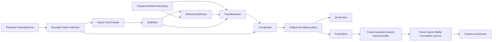

# Architecture

## Status and scope

Milestone 3 implements the desktop shell, physical-camera preview, and local reference
enrollment. The reference subsystem validates, aligns, normalizes, caches, saves, and loads
the eight initial pose/expression images. Live tracking through virtual output in the diagram
remains planned. Target platform: Windows 11 x64, initial input/output 1280×720 at 30 FPS.

Python 3.12 is the tested minor version. PySide6 supplies the desktop UI, NumPy supplies
common image types, and OpenCV with `cv2-enumerate-cameras` supplies the current Windows
camera adapter. MediaPipe Face Landmarker runs in still-image mode only during reference
enrollment. Neural portrait rendering and native output dependencies remain deferred.
Importing modules never opens hardware or initializes the face detector.

## Intended pipeline

The preview and sink must receive the same completed output image after failure
policy is applied. Physical input and virtual output have distinct identities and
lifecycles. Do not feed the FaceLive output back into its own input.

## Component boundaries

| Protocol | File | Responsibility |
| --- | --- | --- |
| `CameraSource` | `app/camera/protocol.py` | Enumerate, explicitly open physical input, negotiate format, retrieve newest frame, close |
| `FaceTracker` | `app/tracking/protocol.py` | Submit frames asynchronously and retrieve newest result without leaking backend types |
| `ReferenceLibrary` | `app/reference/protocol.py` | Load/validate/align/cache references once, expose immutable snapshots, clear |
| `ReferenceSelector` | `app/reference/protocol.py` | Produce continuous normalized weights for pose/expression |
| `FaceRenderer` | `app/rendering/protocol.py` | Render a face and mask; deterministic implementation first, swappable backend later |
| `Compositor` | `app/compositing/protocol.py` | Blend into the matching original frame, preserving pixels outside the mask |
| `Stabilizer` | `app/stabilization/protocol.py` | Smooth geometry/expression, preserve identity/time, reset history |
| `FrameSink` | `app/pipeline/protocol.py` | Accept completed frames without blocking or accumulating latency |

These are structural `typing.Protocol` interfaces, not inheritance requirements or
runtime validators. `OpenCVCameraSource` implements camera input and
`ReferenceLibraryStore` implements the stable `ReferenceLibrary` surface plus enrollment,
persistence, and slot-management operations. Other stages and their boundary validation
will accompany their milestones.
The data records are in `app/pipeline/types.py`. Qt, MediaPipe, OpenCV, and Windows
objects must remain inside adapters. Stage failures use `StageError`; programming
errors must be logged and handled at the orchestration boundary as processing failures.

## Contracts to preserve

### Images and ownership

- Live images are unmirrored, C-contiguous NumPy `uint8` arrays, shape `(height,
  width, 3)`, RGB channel order. Camera adapters convert BGR; output adapters convert
  RGB to native formats. `FrameFormat` describes this fixed internal format.
- FaceLive mirrors only its local preview by default, controlled by the **Mirror local
  preview** toggle. This display transform operates on the UI-owned `QImage`; it never
  changes the canonical `VideoFrame`. Tracking, rendering, compositing, and the future
  virtual-camera sink consume unmirrored frames. Meeting applications may mirror their
  own local self-view, while remote participants receive the unmirrored output.
- Alpha masks are full-frame `float32` arrays `(height, width)`, finite in `[0, 1]`.
  The renderer outputs full-frame RGB plus alpha to avoid ambiguous crop transforms.
  Full-frame allocation cost is an intentional initial simplicity tradeoff; profile
  before introducing ROI buffers.
- Frozen dataclasses prevent field rebinding; they do **not** freeze NumPy arrays or
  mappings. Producers must publish read-only snapshots (or enforce exclusive ownership),
  keep their buffers alive while referenced, and never overwrite published storage.
  Consumers must not mutate inputs. A retaining adapter must keep ownership or copy.
  Compositing produces a new frame and preserves original pixels wherever alpha is zero.
- Reference arrays and landmarks refer to aligned reference-image coordinates and
  remain cached until the library is cleared. Expensive preprocessing never runs per frame.
- Enrollment images are converted to unmirrored RGB, validated by a detector adapter, and
  aligned from their eye landmarks into a 512×512 immutable image. The cached landmark
  schema is `mediapipe-face-landmarker-478-v1`. Renderer code must check that schema before
  consuming the points.

### Reference-library persistence

- The JSON manifest schema is `facelive-reference-library`, version 1. It stores slot
  definitions, pose/expression labels, source-image metadata, quality measurements,
  blendshapes, normalized landmarks, and checksums. This explicit slot list permits more
  poses and optional expression variants without changing the pipeline types.
- Normalized PNG assets live beside the manifest in `<manifest-name>_assets`. Original
  source images are not copied into the library. Paths are resolved within the manifest
  directory and asset checksums are verified before decoding.
- A failed load clears the current library. Incompatible schema, normalization dimensions,
  landmark schema, duplicate slot IDs, missing assets, invalid landmarks, and checksum
  failures are rejected rather than partially loaded.
- The source filename and SHA-256 digest identify enrollment input for diagnostics. They
  are metadata, not proof of consent or identity. Library files contain biometric data and
  should remain under the user's control.

### Time, geometry, and expressions

- `frame_id` and `timestamp_ns` are strictly increasing within a capture session.
  Timestamp is capture time from the monotonic clock (`time.monotonic_ns`), not wall
  time. All downstream records preserve them. Restarting capture resets all histories
  and retained frames; IDs are not globally persistent identities.
- Async tracking results must match the retained original frame by **both** ID and
  timestamp. Never composite an old result onto the newest unrelated frame. Use bounded
  frame retention; discard results whose matching frames have already been dropped.
- `FaceState` uses full-frame pixel coordinates with origin at the upper left,
  x right, y down. Bounds are x/y/width/height. Scale is bounding width / image width.
  Coordinates can extend outside the frame; clipping belongs to render/composite adapters.
- Pose is in degrees: positive yaw turns toward image right (the subject's left in
  an unmirrored image); positive pitch looks down; positive roll is clockwise in the
  image. Roll and distance changes are geometric, not separate reference categories.
- Landmark ordering is described by an explicit versioned `landmark_schema`. Renderer
  and library must reject incompatible schemas instead of guessing by point count.
  No MediaPipe landmark ordering is hard-coded in core types.
- Blendshape coefficients are finite `[0, 1]`, with adapter-normalized canonical names
  such as `eye_blink_left`, `eye_blink_right`, `jaw_open`, `mouth_smile_left`, and
  `mouth_smile_right`; left/right identify the subject. Missing coefficients mean
  unavailable, not measured zero. Exact supported names and schema are finalized with
  the tracking milestone. Confidence `[0, 1]` must have a documented adapter derivation;
  do not imply a confidence score that the backend does not provide.
- Selection weights are finite, nonnegative, reference existing IDs, and sum to 1 for
  a nonempty result. Empty selection means no usable reference/unsupported pose.

### Scheduling and lifetime

- Qt widgets and the event loop stay on the GUI thread. Camera opening runs in a small
  executor because device setup may block. The camera adapter owns a capture thread;
  a 10 ms Qt timer polls its latest complete frame. The GUI copies RGB pixels into a
  `QImage` before releasing the source snapshot. Reference enrollment is a user-triggered,
  one-time synchronous operation; it is never part of the live-frame loop. Future live
  processing runs outside Qt.
- `CameraSource.read_latest`, `FaceTracker.submit/poll_latest`, and `FrameSink.publish`
  are nonblocking. Implementations use bounded storage and favor the newest complete
  frame. Resource setup/loading can block and belongs outside the GUI thread later.
- `submit(False)` explicitly reports a busy-frame drop. `poll_latest(None)` means no
  new result. `NO_FACE` is a completed tracking result, distinct from pending work.
  `TRACKED` carries a matching `FaceState`; `ERROR` carries an error and no face.
- Synchronous stage faults raise `StageError`; asynchronous faults return `ERROR`.
  Close/clear/reset operations are idempotent. Close stops worker callbacks before
  releasing buffers. Calls are serialized by the future pipeline controller; arbitrary
  concurrent public calls are not promised to be safe.
- Reset stabilization and drain pending work on source/library changes, tracking loss,
  and restart. Reconfiguration must quiesce callbacks before replacing references.
- Sink `False` means dropped/unconsumed, not a processing failure. Consumer disconnect
  does not stop preview. No unbounded queue, including the UI delivery queue, is allowed.

## Failure policy

Product decision: output a configured placeholder whenever a valid processed frame
cannot be produced while replacement is enabled. Never automatically fall back to
raw camera video or stale reference identity. The local UI shows the reason. A future
explicit user action to disable replacement may enable raw passthrough; enabling
passthrough and its visible state must be implemented together. Milestone 3 only previews
the raw physical input locally and emits no virtual-camera video.

| Event | Intended behavior |
| --- | --- |
| Tracking lost / unsupported pose | Placeholder, show reason, reset smoothing |
| No library / library load fails | Placeholder; a failed load clears the previous subject |
| Physical camera disconnect | Placeholder; report input failure, no automatic source switch |
| Virtual consumer disconnect | Keep preview and processing; drop unconsumed frames |
| Renderer/compositor/model/GPU failure | Placeholder; report fault and release/restart affected stage explicitly |
| Malformed configuration / unavailable log directory | Fail startup with exit 2 and a diagnostic |
| Unexpected application failure | Log traceback, exit 1 |

Placeholder generation, recovery controller, freshness timeout, and IPC delivery are
future work. The native consumer must eventually enforce a producer heartbeat timeout
and emit its own placeholder when the producer dies; it cannot rely solely on Python.
Final timeout thresholds and reconnect UX need measurement and product review.

## Performance and future native boundary

Instrument capture, tracking, selection, rendering, compositing, and transfer separately.
Measure end-to-end age from capture timestamp, processed/output FPS, and dropped frames
by stage. The Milestone 1 shell measures capture FPS from frame IDs and monotonic capture
timestamps, so UI polling skips do not reduce the estimate; skipped preview frames are
reported separately. On the development Integrated Webcam, an eight-second standalone
run negotiated 1280×720/30 and observed 27.55 capture FPS with zero polling skips. A
live Qt preview check observed 25.7 FPS. These results are device and lighting dependent.

After the preview pipeline is stable, implement a C++ Media Foundation custom Media
Source registered using `MFCreateVirtualCamera`, based on Microsoft's Windows Camera
sample. Keep all ML/image processing outside that layer. A versioned shared-memory
bounded ring will carry frame metadata and completed pixels. Sequence counters,
publication synchronization, heartbeat/fallback, access permissions, pixel conversion,
and ABI details require their own milestone. `FrameSink` is a Python abstraction,
**not** a shared-memory ABI. No native implementation exists yet.

## References

- [Qt for Python setup](https://doc.qt.io/qtforpython-6/gettingstarted.html)
- [MediaPipe Face Landmarker for Python](https://developers.google.com/edge/mediapipe/solutions/vision/face_landmarker/python)
- [MediaPipe Face Landmarker models](https://developers.google.com/edge/mediapipe/solutions/vision/face_landmarker/index#models)
- [uv Python provisioning](https://docs.astral.sh/uv/guides/install-python/)

Neural refinement is deferred until deterministic geometry has been evaluated. Continue
only after an explicit instruction for the next milestone.
